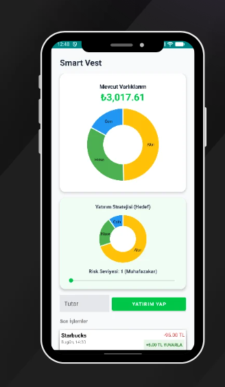
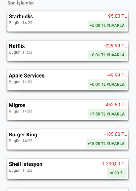
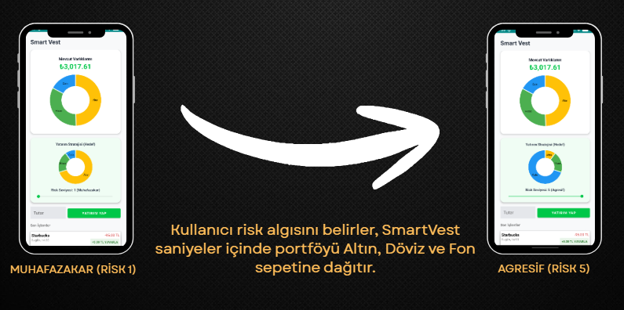

# SmartVest: Autopilot Investment for Gen Z 🚀

This repository contains the Frontend UI/UX implementation and architectural concept of SmartVest, built entirely with **Jetpack Compose**. It was originally designed as a strategic Fintech project pitched for the Garanti BBVA "Genç Fikrinle Parla" program.

## 📖 The Problem: The Gen Z Investment Paradox
Young people are constantly advised to invest, but existing traditional banking apps and crypto exchanges present massive barriers:
* **High Entry Barriers:** A misconception that you need "big money" to start.
* **Complex Interfaces:** Overwhelming charts and heavy financial jargon.
* **Lack of Discipline:** Struggling to manually save money at the end of the month.

## 💡 The Solution: Invisible Accumulation
**SmartVest** eliminates these barriers by turning everyday spending into an autopilot investment strategy. 

* **Round-Up Tech:** Spend 95 TL on a coffee, SmartVest rounds it up to 100 TL. The 5 TL difference is seamlessly and invisibly set aside.
* **Autopilot Portfolio:** Based on user-defined risk profiles, the micro-savings are instantly distributed into Gold, Mutual Funds, or Digital Assets. No manual trading required.

## 📱 UI Showcase

| Dashboard | Round-Up Automation | Risk Management |
| :---: | :---: | :---: |
|  |  |  |

## 🛠️ Technical Stack
* **Language:** Kotlin
* **UI Toolkit:** Jetpack Compose
* **Architecture:** MVVM (Model-View-ViewModel) concept applied for UI state management.
* **Design System:** Custom material theme focusing on a dark, modern, "Gen Z-friendly" aesthetic.

## 📊 Business Model & Presentation
I don't just write code; I build products with a sustainable business model. You can find the detailed 10-page market analysis, target audience, and business model in the **SmartVest_Sunumu.pdf** file included in this repository.

## 👨‍💻 Developed By
**Uğur Erdoğan** Software Engineering Student | Fintech & UI/UX Enthusiast
* LinkedIn: [Uğur Erdoğan](https://www.linkedin.com/in/ugur-erdogan-tr/)
* Email: ugurtlf23@gmail.com
